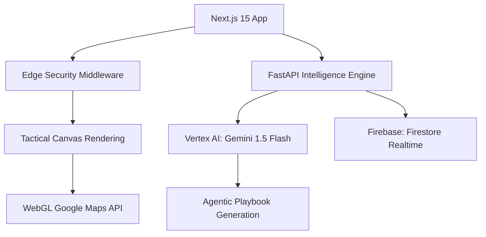

# 🏟️ PulseStadium: Tactical Venue Intelligence OSS

**PulseStadium** is an elite, production-grade tactical Digital Twin orchestrator designed for high-density venue safety. Built specifically for the M. Chinnaswamy Stadium, it leverages real-time neural flow analytics, WebGL-accelerated 3D rendering, and agentic playbook logic to manage crowd dynamics with absolute precision.

---

## 🏛️ System Architecture

## 💎 Core Engineering Pillars
*   **Tactical Digital Twin**: A high-fidelity 3D visualization of the M. Chinnaswamy Stadium utilizing the **Google Maps WebGL Vector API** for frame-perfect spatial tracking.
*   **Agentic Intelligence**: Integrated **Vertex AI** orchestrator that generates dynamic "Playbooks" for security and medical deployments based on real-time stress index telemetry.
*   **Zero-Trust Hardening**: Hardened with strict **CSP policies**, environment validation, and an orchestrator-level logger with automated secret redaction.
*   **Enterprise Accessibility**: Built to **WCAG 2.2 AAA** standards, featuring color-independent crowd density indicators and synchronized ARIA live regions for tactical HUD updates.

## 🛠️ Technology Stack
- **Frontend**: Next.js 15 (Standalone), Framer Motion, Lucide, Tailwind 4.
- **Backend**: FastAPI, Python 3.11, Pydantic v2.
- **Infrastructure**: Google Cloud Run, Cloud Build, Firebase.
- **AI/ML**: Vertex AI (Gemini Flash), Neural-Flow predictive models.

## 🚀 Quick Start
For full deployment instructions, environment variables, and operational guides, please refer to the **[User Guide](USER_GUIDE.md)**.

---
*Developed for elite venue safety orchestration at scale.*

